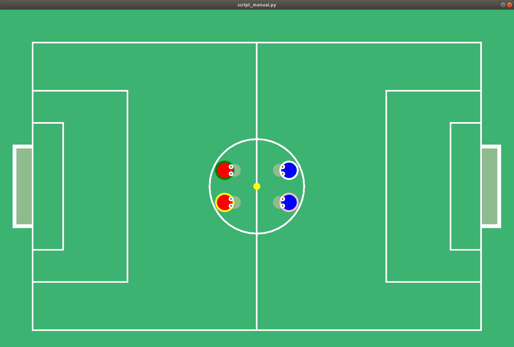

# Robocup Gym

This is a student project during my studies at Bordeaux University. I was part of a team of 6 people.
Robocup is a team-based football game where two teams compete against each other. To make the players perform well, it is necessary to train them. This project aims to develop an environment for multi-agent contexts in which two teams of autonomous players compete against each other. To train the players, the project implements a reinforcement learning script (genetic algorithm), an evaluation script of an algorithm against a random agent, and a manual mode for testing the functionalities and parameters of a game.

## Installation
To install the project, clone this repository.
To run the scripts, load the `environment.yml` with conda.

## Usage
Once you've installed the libraries, you can test the application by running the following command:
`python script_manual.py`

The manual mode allows you to test the game interface with the keyboard. The parameters of the game are defined in the env.json file located in the src/robocup/specs/env.json directory. In this mode, only four players are implemented.

**script_manual.py**: This script provides a manual way to control an agent in the environment. It allows a user to control the agent using the keyboard to move around and interact with objects in the environment. This script can be useful for debugging or testing the environment.

**script_evaluation_multiagent.py**: This script evaluates the performance of multiple agents in the environment. It runs the specified number of episodes and returns the average reward obtained by each agent. This script is useful for comparing the performance of different agents and selecting the best one for deployment.

**training_scripts/**: This directory contains various scripts used for training the agent. The scripts use different reinforcement learning algorithms, such as DQN or PPO, and can be run on different environments. Each script trains the agent using a specified hyperparameter configuration and saves the trained model to disk. These scripts are used to train the agent from scratch or fine-tune a pre-trained agent on a new task. The trained model can then be used for inference in the environment.

## Tests

To run the tests, go to `/src` directory and run `pytest`